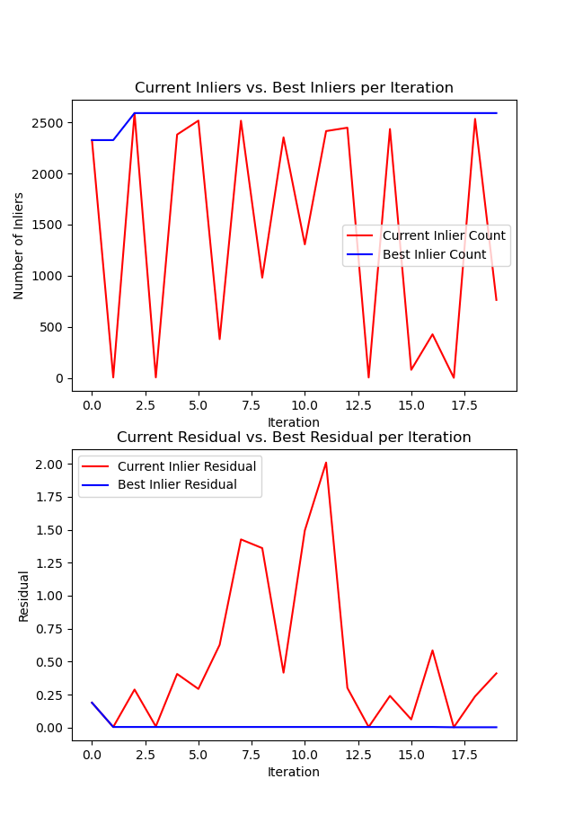
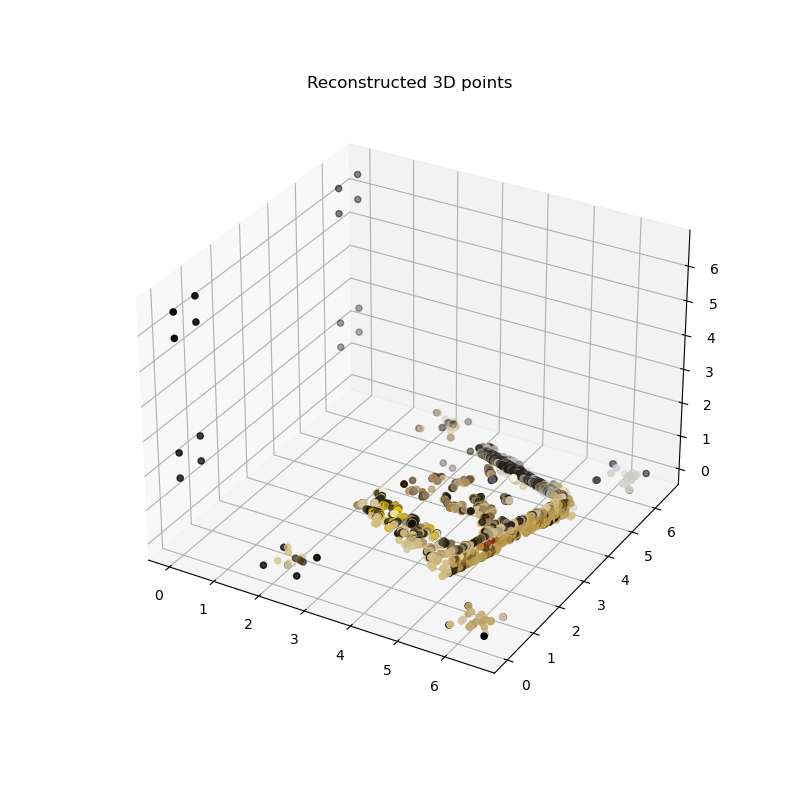

# CSCI 1430 Results Log

HW3 required items:

A plot of one of RANSAC's F-matrix estimation performance over iterations.

In response this, here is a required image.

An image of a 3D reconstruction of one of the sequences (cards, mikeandikes, or dollar).

In response this, here is a required image.

## Extra credit?

I didn't attempt extra credits.

## Anything else?

Giraffes---_how do they even?!_ 🦒